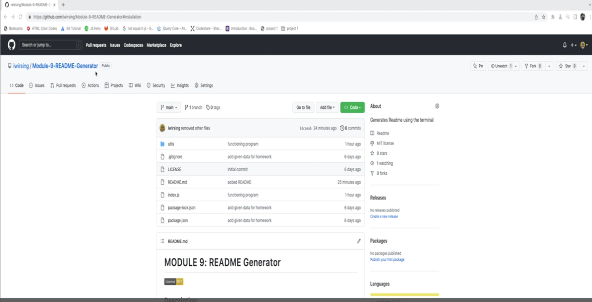

# MODULE 9: README Generator

##  Description:

This program dynamically generates a professional README_<projectname>.md file from a user's input through the command-line. This program uses the Inquirer package.   e and is ran outside of the browser and in the terminal.

##  Table of Contents 
1. [Installation](#installation)
2. [Usage](#usage) 
3. [Contributing](#contributing) 
4. [Video Demonstration](#test) 
5. [Questions](#questions)
6. [License](#license)
7. [Sources](#sources)

## Installation 

1. First, download the files to a folder. 
2. Then go to the root folder of the downloaded project and open the folder in the terminal.
3. Next, type `npm install` to install all the dependencies.
4. Afterwards, type `node index.js` to run the program. 
5. The user then types the answers corresponding to the prompts in the terminal. 
6. When the prompts and answering are done, `README_<projectTitle>.md` is generated. 
7. Finally, open the file to check for correctness, move the README file to the correct folder and rename it to just `README.md`.

## Contributing 

Ask permission from the author.

## Video Demonstration

## Questions? 

Please contact me through any of the following:

1. My [Github]('https://github.com/'+iwirsing).
2. Email: <a href="mailto:ivymolina@gmail.com">ivymolina@gmail.com</a>

## License

The project in covered under the [MIT](https://opensource.org/licenses/MIT) license.

## Sources
1. https://stackoverflow.com
2. https://coding-boot-camp.github.io/full-stack/github/professional-readme-guide

